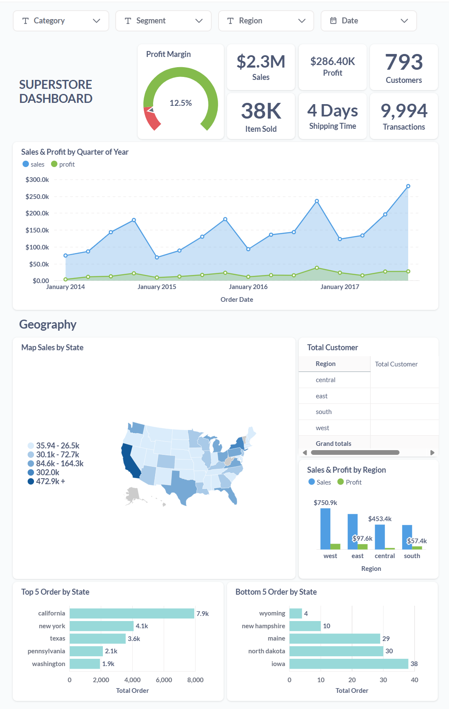
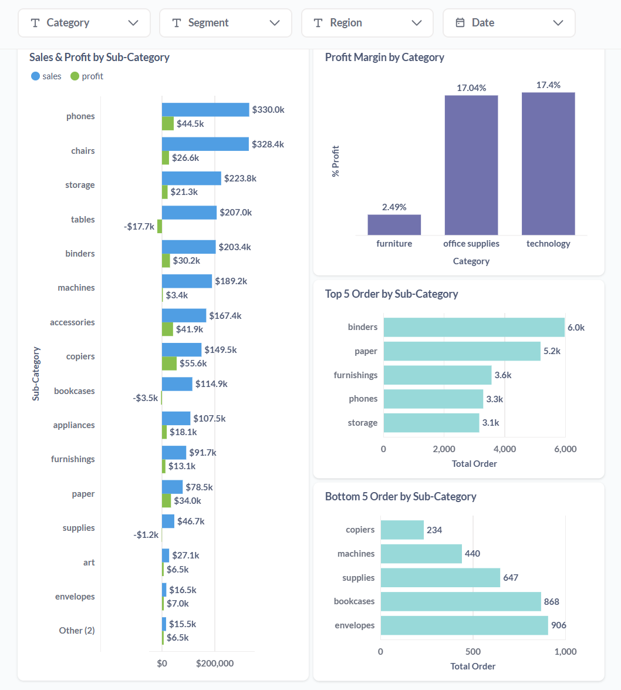
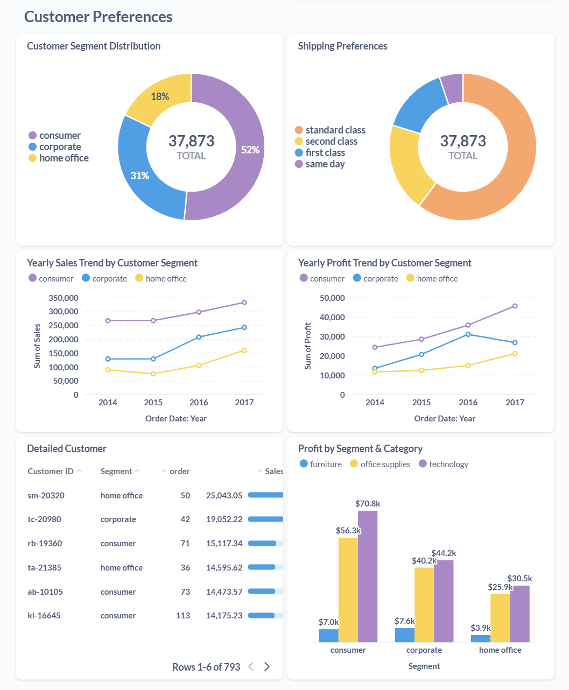
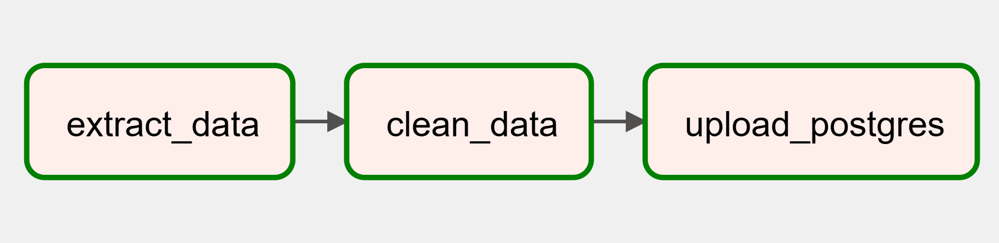

# Superstore Analysis & ETL Automation

## 📌 Project Overview
This project focuses on automating the **ETL process** for Superstore data, conducting **data analysis**, and building an **interactive dashboard** to extract meaningful business insights.

### 🔑 Key Features:
✅ **ETL Automation**: Extracts data from **PostgreSQL**, transforms it using **Python**, and loads it back into a different table in **PostgreSQL**.   
✅ **Automated Scheduling**: ETL process runs **every Monday** to maintain up-to-date data.   
✅ **Data Analysis**: Performed in **Jupyter Notebook** to explore trends and key performance indicators.   
✅ **Interactive Dashboard**: Built using **Metabase** to visualize insights for better decision-making.   

## 🔍 Analysis Summary & Key Insights
### **1. Performance & Profitability**
- **$2.3M** in sales, but only **$286K** in profit (12.03% margin, below the 15% target).
- Sales have **steadily increased**, but profit remains stable, indicating inefficiencies.
- **Q4 (holiday season)** sees peak sales, while **Q1** experiences a drop.

### **2. Geographical Performance**
- **West & East regions** lead in sales and profit, especially **California & New York**.
- **Central region underperforms**, with Texas showing high sales but **low or negative profit**.

### **3. Product Insights**
- **Technology (17%) & Office Supplies (17%)** have strong profit margins.
- **Furniture (2.5%)** struggles, with **Tables & Bookcases** incurring losses.

### **4. Customer Segments**
- **Consumer segment** dominates sales & profit with year-over-year growth.
- **Corporate & Home Office** have untapped growth potential, particularly in B2B strategies.
- **Standard Class shipping** is the most preferred, indicating price sensitivity over speed.

## 📢 Recommendations
### **1. Optimize Pricing Strategies**
- Reduce **discounts** on high-margin products and in low-profit states (e.g., Texas).
- Run **post-holiday promotions** to mitigate Q1 sales dip.
- Focus marketing efforts on **holiday season sales** while improving cost efficiency.

### **2. Geographical Strategies**
- Expand **market penetration in the South** due to lower presence.
- Invest more in marketing for **high-performing states (California, New York).**

### **3. Customer Segment Strategies**
- Offer **personalized promotions & loyalty programs** for high-value customers.
- Introduce **bulk purchase discounts & B2B incentives** to attract corporate clients.

## ➡️ ETL Pipeline

  

## 🤝 Connect with Me
If you have feedback or suggestions, feel free to reach out or connect on [LinkedIn](linkedin.com/in/fadhiildzaki)!
